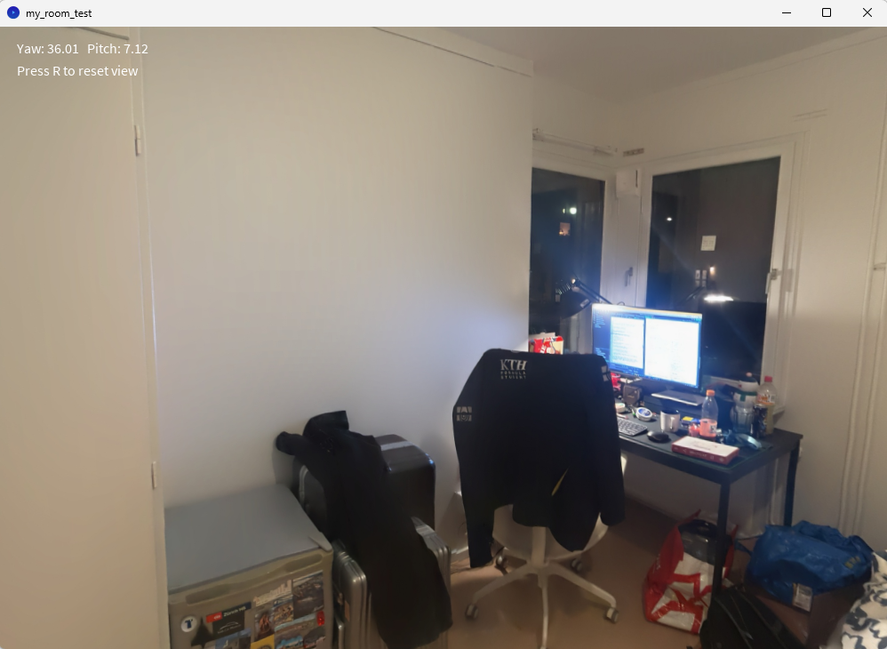
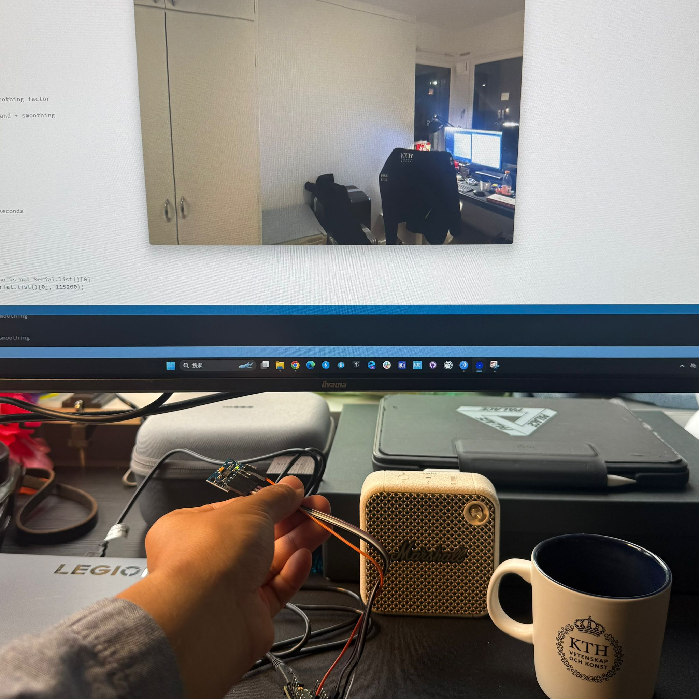
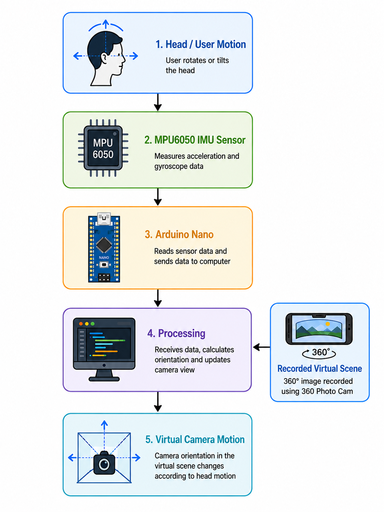
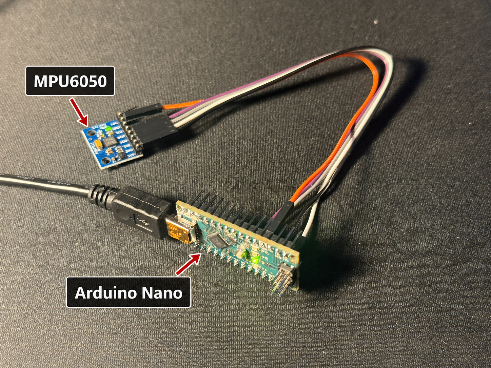

# IMU-Based Head Tracking for a Panoramic Virtual Environment

**DH2323 Computer Graphics and Interaction — KTH Royal Institute of Technology**  
**Author:** Keyuan (Charles) Zhang  
**Supervisor:** [Prof. Christopher Edward Peters](https://www.kth.se/profile/chpeters)

This project investigates whether a low-cost MPU6050 inertial measurement unit (IMU) and an Arduino Nano can provide real-time camera control in a virtual panoramic environment. The sensor measures angular velocity, the Arduino sends the readings over USB serial, and a Processing application integrates the measurements into camera yaw and pitch.

The project focuses on the full interaction pipeline and its practical challenges: sensor noise, gyroscope drift, filtering, responsiveness, and mapping physical motion to a virtual viewpoint.

## Final demonstration

<p align="center">
  
</p>

Rotating the MPU6050 changes the view direction inside a 360-degree image captured with a smartphone. The final application supports three processing modes, a camera reset, a 30-second stationary drift test, and screenshot capture.

### Video demonstration

<p align="center">
  <a href="media/videos/final-demo.mp4">
    
  </a>
</p>

<p align="center">
  <em>Click the image to watch the demonstration video.</em>
</p>

## Project deliverables

- [Comprehensive project report](docs/project-report.pdf)
- [Final project specification](docs/project-specification.pdf)
- [Commented Arduino and Processing source code](#repository-structure)
- This README as the project progress blog and demonstration page

## System overview

<p align="center">
  
</p>

The interaction pipeline is:

1. The user rotates or tilts the MPU6050.
2. The Arduino Nano reads the three gyroscope axes over I2C.
3. Raw values are converted to angular velocity in degrees per second.
4. Three comma-separated values are transmitted at 115200 baud.
5. Processing filters and integrates the measurements.
6. The estimated yaw and pitch define the camera direction inside a textured sphere.

## Hardware

<p align="center">
  
</p>

### Components

- Arduino Nano
- MPU6050 / GY-521 IMU module
- Four jumper wires
- USB cable and a computer running Arduino IDE and Processing 4

### Wiring

| MPU6050 | Arduino Nano | Purpose |
| --- | --- | --- |
| VCC | 5V | Module power |
| GND | GND | Ground |
| SDA | A4 | I2C data |
| SCL | A5 | I2C clock |

The code uses the default MPU6050 I2C address `0x68`, which assumes the AD0 pin is low.

## How it works

### Gyroscope acquisition

The firmware configures the gyroscope for the ±250 degrees/s range. With a sensitivity of 131 LSB/(degrees/s), each raw measurement is converted using:

```text
angular velocity = raw gyroscope value / 131
```

The Arduino transmits each sample as:

```text
gyroX,gyroY,gyroZ
```

### Orientation estimation

The MPU6050 measures angular velocity rather than absolute orientation. Processing therefore estimates orientation by numerical integration:

```text
yaw(k)   = yaw(k-1)   + gyroZ * dt
pitch(k) = pitch(k-1) + gyroX * dt
```

Pitch is constrained to ±85 degrees to prevent the virtual camera from flipping upside down.

### Camera transformation

Yaw and pitch are converted to a direction vector:

```text
lookX =  sin(yaw) * cos(pitch)
lookY =  sin(pitch)
lookZ = -cos(yaw) * cos(pitch)
```

The panoramic image is mapped onto the inside of a large sphere. The camera remains at its center and looks in the direction calculated above.

### Noise reduction

Three configurations are available during runtime:

| Key | Mode | Purpose |
| --- | --- | --- |
| `1` | Raw gyroscope | Baseline with no filtering |
| `2` | Deadband | Ignores values below 1.0 degrees/s |
| `3` | Deadband + EMA | Adds exponential smoothing with alpha = 0.15 |

The deadband prevents small stationary sensor bias from continuously accumulating into camera motion. The exponential moving average (EMA) is:

```text
smoothed(n) = alpha * filtered(n) + (1 - alpha) * smoothed(n-1)
```

## Evaluation and results

The sensor was held stationary for 30 seconds after resetting the camera. The accumulated yaw and pitch deviations were then recorded.

| Processing method | Yaw drift | Pitch drift |
| --- | ---: | ---: |
| Raw gyroscope | 16.19° | 20.50° |
| Deadband | 0.00° | 0.03° |
| Deadband + EMA | 0.00° | 0.06° |

The deadband produced the main improvement in stationary stability. EMA smoothing did not further reduce stationary drift, but it improved perceived smoothness during active motion. This introduces a trade-off: stronger smoothing looks steadier but can feel less responsive.

Responsiveness and movement smoothness were evaluated qualitatively because no external motion-capture or high-speed latency measurement system was available.


## Running the project

### 1. Upload the Arduino firmware

1. Connect the MPU6050 and Arduino Nano using the wiring table above.
2. Open `arduino/MPU6050_gyro/MPU6050_gyro.ino` in Arduino IDE.
3. Select the correct Nano board, processor, and serial port.
4. Upload the sketch.
5. Close the Arduino Serial Monitor before starting Processing, because only one program can normally use the serial port at a time.

### 2. Verify the 3D prototype (optional)

1. Open `processing/serial_input_MPU6050/serial_input_MPU6050.pde` in Processing.
2. Check the printed `Serial.list()` output.
3. If needed, change `Serial.list()[0]` to the index of the Arduino port.
4. Run the sketch and rotate the sensor.

### 3. Run the panoramic application

1. Open `processing/my_room_test/my_room_test.pde` in Processing.
2. Keep `my_room_lappis.jpg` in the same sketch folder.
3. Select the correct serial-port index in the code if necessary.
4. Run the sketch.

### Controls

| Key | Action |
| --- | --- |
| `1` | Use raw gyroscope data |
| `2` | Use the deadband filter |
| `3` | Use deadband and EMA smoothing |
| `R` | Reset yaw and pitch |
| `T` | Start a 30-second stationary drift test |
| `P` | Save a screenshot |

## Repository structure

```text
.
├── README.md
├── arduino/
│   └── MPU6050_gyro/
│       └── MPU6050_gyro.ino
├── processing/
│   ├── serial_input_MPU6050/
│   │   └── serial_input_MPU6050.pde
│   └── my_room_test/
│       ├── my_room_test.pde
│       └── my_room_lappis.jpg
├── media/
│   ├── images/
│   └── videos/
└── docs/
    ├── DH2323_CGI_Project_Report_Keyuan_Z.pdf
    └── DH2323_CGI_Project_Specification_Keyuan_Z.pdf
```

## Limitations and future work

- Gyroscope integration still lacks an absolute yaw reference, so drift can accumulate over long sessions.
- The deadband may ignore very slow intentional motion.
- Responsiveness was judged qualitatively rather than measured with external equipment.
- A calibration stage could estimate and subtract stationary gyro bias.
- Accelerometer/gyroscope sensor fusion could improve pitch and roll estimation.
- An escape-room interaction could trigger clues or animations when the user looks at defined regions.
- A custom head mount and a more detailed driving scene would improve the final experience.

## References and acknowledgements

- [Tobii Gaming — Euro Truck Simulator 2 eye and head tracking](https://gaming.tobii.com/games/euro-truck-simulator-2/)
- [360 Photo Cam](https://360photocam.com/) was used to capture the panoramic test environment.
- Arduino, Processing, and their standard libraries were used to implement the prototype.
- AI tools were used to assist with language editing, code discussion, and documentation structure. The project design, implementation, testing, results, and final verification remain the author's work.

For the full theoretical discussion, evaluation method, and references, see the [project report](docs/DH2323_CGI_Project_Report_Keyuan_Z.pdf).
